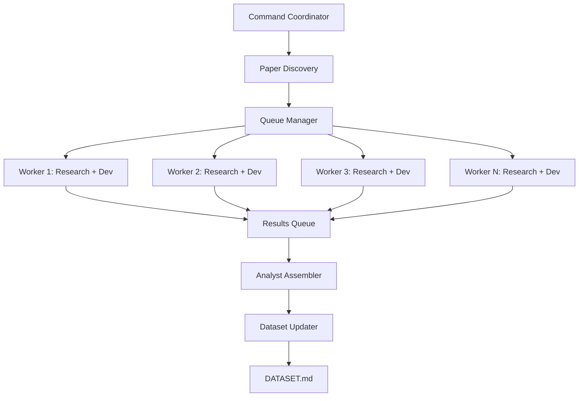

# Build Dataset Command

## Overview
Parallelized command system for building and updating the multi-agent systems security testing dataset. Spawns individual researcher and developer agents per paper to manage context efficiently.

## Command Structure

### Main Command
```bash
# Build or update dataset
/build-dataset [options]

Options:
  --source <file>     Source file with papers (default: README.md)
  --limit <n>         Process only n papers (default: all)
  --update            Update existing dataset (default: false)
  --parallel <n>      Number of parallel agents (default: 5)
  --tier <1-4>        Minimum tier to include (default: 3)
  --output <file>     Output file (default: DATASET.md)
```

## Architecture



## Implementation

### 1. Command Coordinator
```python
class DatasetCoordinator:
    """
    Main coordinator that manages the parallel processing pipeline
    """
    
    def __init__(self, config):
        self.source_file = config.get('source', 'README.md')
        self.limit = config.get('limit', None)
        self.parallel_workers = config.get('parallel', 5)
        self.min_tier = config.get('tier', 3)
        self.output_file = config.get('output', 'DATASET.md')
        self.update_mode = config.get('update', False)
        
    def execute(self):
        # 1. Discover papers
        papers = self.discover_papers()
        
        # 2. Filter already processed (if update mode)
        if self.update_mode:
            papers = self.filter_unprocessed(papers)
        
        # 3. Create work queue
        work_queue = self.create_queue(papers)
        
        # 4. Spawn parallel workers
        results = self.process_parallel(work_queue)
        
        # 5. Assemble dataset
        dataset = self.assemble_dataset(results)
        
        # 6. Write/update output
        self.write_dataset(dataset)
```

### 2. Paper Processor (Individual Worker)
```python
class PaperProcessor:
    """
    Processes a single paper with dedicated researcher and developer agents
    Runs in isolated context to avoid context window issues
    """
    
    def process_paper(self, paper_info):
        # Extract basic info
        title = paper_info['title']
        arxiv_url = paper_info['arxiv_url']
        content = paper_info['content']
        
        # Phase 1: Research Analysis
        research_result = self.research_agent.analyze(
            title=title,
            arxiv_url=arxiv_url,
            content=content
        )
        
        # Phase 2: Repository Analysis (if GitHub found)
        dev_result = None
        if research_result.get('github_url'):
            dev_result = self.developer_agent.analyze(
                github_url=research_result['github_url'],
                paper_title=title
            )
        
        # Phase 3: Score and classify
        scores = self.calculate_scores(research_result, dev_result)
        
        # Return consolidated result
        return {
            'paper_info': paper_info,
            'research_analysis': research_result,
            'repository_analysis': dev_result,
            'scores': scores,
            'decision': self.make_decision(scores)
        }
```

### 3. Parallel Processing Manager
```python
def process_parallel(papers, max_workers=5):
    """
    Process papers in parallel with context isolation
    """
    from concurrent.futures import ThreadPoolExecutor, as_completed
    
    results = []
    
    with ThreadPoolExecutor(max_workers=max_workers) as executor:
        # Submit all papers for processing
        future_to_paper = {
            executor.submit(process_single_paper, paper): paper 
            for paper in papers
        }
        
        # Collect results as they complete
        for future in as_completed(future_to_paper):
            paper = future_to_paper[future]
            try:
                result = future.result(timeout=300)  # 5 min timeout
                results.append(result)
                print(f"✓ Processed: {paper['title'][:50]}...")
            except Exception as e:
                print(f"✗ Failed: {paper['title'][:50]}... - {e}")
                
    return results

def process_single_paper(paper):
    """
    Process a single paper in isolated context
    This runs in a separate thread/process
    """
    processor = PaperProcessor()
    return processor.process_paper(paper)
```

### 4. Dataset Assembler
```python
class DatasetAssembler:
    """
    Assembles individual results into final dataset
    Single analyst agent that maintains overall coherence
    """
    
    def assemble(self, results):
        # Sort by tier and score
        sorted_results = self.sort_results(results)
        
        # Group by decision
        grouped = {
            'included': [],
            'excluded': [],
            'review': []
        }
        
        for result in sorted_results:
            decision = result['decision']
            if decision == 'INCLUDE':
                grouped['included'].append(result)
            elif decision == 'EXCLUDE':
                grouped['excluded'].append(result)
            else:
                grouped['review'].append(result)
        
        # Generate statistics
        stats = self.calculate_statistics(grouped)
        
        # Create final dataset structure
        dataset = {
            'metadata': {
                'generated': datetime.now().isoformat(),
                'total_analyzed': len(results),
                'included': len(grouped['included']),
                'excluded': len(grouped['excluded']),
                'review': len(grouped['review'])
            },
            'statistics': stats,
            'systems': grouped
        }
        
        return dataset
```

## Workflow Files

### Individual Paper Analysis Prompt
```markdown
# Paper Analysis Task

You are analyzing a single paper for inclusion in a multi-agent security testing dataset.

## Input
- Title: {title}
- ArXiv: {arxiv_url}
- Content: {content}

## Your Task
1. Extract GitHub/GitLab URLs
2. Identify multi-agent characteristics
3. Assess attack surface
4. Evaluate testing compatibility
5. Return structured JSON result

## Output Format
{
  "title": "",
  "arxiv_url": "",
  "github_url": "",
  "summary": "",
  "multi_agent_complexity": 0-10,
  "attack_surface": 0-10,
  "testing_compatibility": 0-10,
  "security_relevance": 0-10,
  "code_accessibility": 0-10,
  "key_features": [],
  "attack_vectors": [],
  "notes": ""
}

Focus only on this paper. Do not consider other papers.
```

### Repository Analysis Prompt
```markdown
# Repository Analysis Task

You are analyzing a GitHub repository for security testing compatibility.

## Input
- Repository: {github_url}
- Associated Paper: {paper_title}

## Your Task
1. Assess code structure and quality
2. Check deployment options (Docker, CLI, API)
3. Evaluate testing automation potential
4. Identify security testing opportunities
5. Return structured JSON result

## Output Format
{
  "github_url": "",
  "setup_complexity": "simple|moderate|complex",
  "deployment_options": [],
  "testing_interfaces": [],
  "observability": 0-10,
  "code_quality": 0-10,
  "documentation": 0-10,
  "active_maintenance": true/false,
  "dependencies": [],
  "red_flags": [],
  "notes": ""
}

Focus only on this repository. Complete analysis in single response.
```

## Dataset Update Logic

### Merge Strategy
```python
def update_dataset(existing_dataset, new_results):
    """
    Merge new results with existing dataset
    """
    # Load existing entries
    existing_ids = {entry['arxiv_id'] for entry in existing_dataset['systems']}
    
    # Add only new entries
    new_entries = []
    updated_entries = []
    
    for result in new_results:
        arxiv_id = extract_arxiv_id(result['arxiv_url'])
        
        if arxiv_id in existing_ids:
            # Update existing entry if scores changed significantly
            if should_update(existing_dataset[arxiv_id], result):
                updated_entries.append(result)
        else:
            # Add new entry
            new_entries.append(result)
    
    # Merge and resort
    merged = existing_dataset.copy()
    merged['systems'].extend(new_entries)
    
    # Update metadata
    merged['metadata']['last_updated'] = datetime.now().isoformat()
    merged['metadata']['new_entries'] = len(new_entries)
    merged['metadata']['updated_entries'] = len(updated_entries)
    
    return merged
```

## Context Management

### Why This Works
1. **Isolation**: Each paper processed in separate context
2. **Parallelization**: Multiple papers processed simultaneously
3. **No Cross-Contamination**: Workers don't share context
4. **Efficient**: Can process 100+ papers without context issues
5. **Scalable**: Add more workers for faster processing

### Context Budget Per Worker
```yaml
per_paper_context:
  paper_content: ~2000 tokens
  research_prompt: ~500 tokens
  research_response: ~1000 tokens
  developer_prompt: ~500 tokens
  developer_response: ~1000 tokens
  total: ~5000 tokens per paper

coordinator_context:
  command_logic: ~1000 tokens
  queue_management: ~500 tokens
  assembly_logic: ~1000 tokens
  total: ~2500 tokens

assembler_context:
  results_summary: ~100 tokens per paper
  statistics: ~500 tokens
  formatting: ~1000 tokens
  total: ~10000 tokens for 100 papers
```

## Usage Examples

### Build Initial Dataset
```bash
# Process all papers from README.md
/build-dataset --source README.md --output DATASET.md

# Process with limits
/build-dataset --limit 50 --parallel 10 --tier 2
```

### Update Existing Dataset
```bash
# Add new papers to existing dataset
/build-dataset --update --source README.md --output DATASET.md

# Update specific section
/build-dataset --update --source resources/Autonomous_Agents_Research_Papers_2025.md
```

### Monitoring Progress
```
Processing papers in parallel...
Worker 1: ✓ LightAgent
Worker 2: ✓ Mobile-Agent  
Worker 3: ⏳ JUPITER
Worker 4: ✓ AgentGym-RL
Worker 5: ⏳ ChemBOMAS

Progress: 45/100 papers processed
Included: 12 | Excluded: 28 | Review: 5
Estimated time remaining: 15 minutes
```

## Error Handling

### Retry Logic
```python
def process_with_retry(paper, max_retries=3):
    """
    Retry failed paper processing
    """
    for attempt in range(max_retries):
        try:
            return process_single_paper(paper)
        except Exception as e:
            if attempt == max_retries - 1:
                # Log failure and continue
                log_failure(paper, e)
                return create_error_entry(paper, e)
            time.sleep(2 ** attempt)  # Exponential backoff
```

### Partial Results
- Save progress every 10 papers
- Resume from checkpoint if interrupted
- Mark incomplete entries for reprocessing